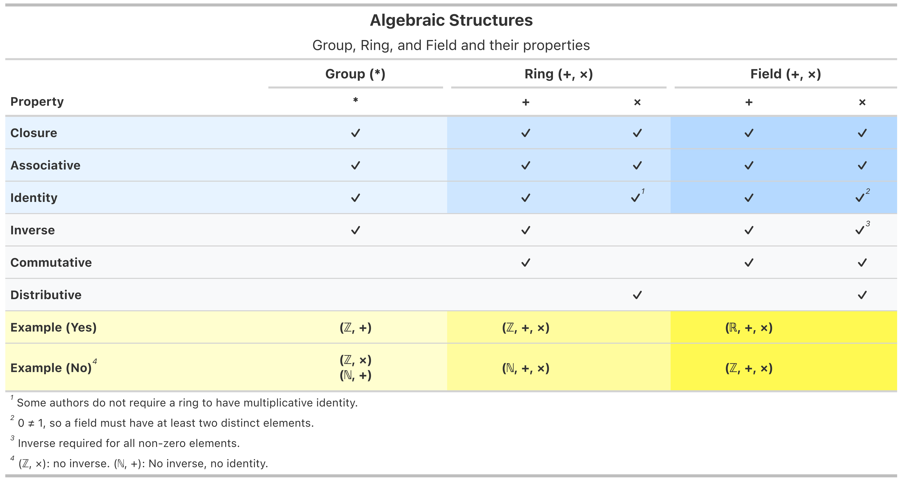

We've always feel thankful for our daughter, who've taught use the value of time in a hard way. In the last two years of my PhD, she rarely fell asleep before midnight and she constantly got sick. So did we. We planned to have a child but we never thought it would be this difficult. We overestimated ourselves. 

The last time she couldn't got to daycare because of illness was the day of my defense. After that, she magically gets stronger and starts to sleep earlier. We've gained some time back. 

With this precious time she offers, I decide to take a break from Statistics and relearn some maths.

I've always think I like analysis a lot more than algebra. I could see analysis but I couldn't quite visualise the group, ring and field and why they matter. Now I start to see why though - and they're everywhere. 

To start off my relearn journey, I created the following table using R package **gt**. 

